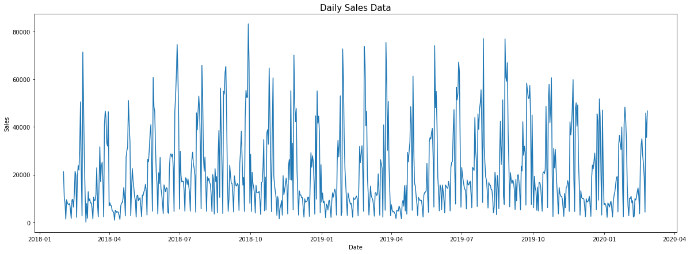
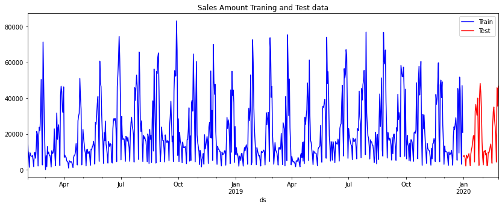

# Sales-Forecasting

## Authors
- Anjana Melam, IIT Madras


## FB Prophet
If `plotly` and `prophet` are not pre-installed, run this piece of code at the beginning.
```
!pip install plotly
!pip install prophet
```
Download the excel sheet `Groceries_Sales.xlsx` provided under the `FB_Prophet` folder

### Extracting and Visualizing data

We make a lineplot of the data in `Groceries_Sales.xlsx` to visualize the kind of data we have been provided with. We can see a seasonality in the data with some peaks occuring every few months.


To decide whether this model is an additive or multiplicative one, we can use the `visualize_data` function. Run the code to see the plots. A few lines later, the `bar_plot_data` function can also be found to see the weekly averaged and yearly averaged data on a bar plot

Next with the funtions `setting_up_data` and `extract_data`, the data is extracted into a format that is user-friendly and easy to process. Go through the code to understand more about this.

### Modelling using Prophet

We rename data to `ds` and sales to `y`. This step is important for further purposes. We split the data into training and testing sets. We do this by setting an end date for the training data and everything after the end data comes under the test data. This is the plot for reference, where the blue region represents the training data and the red region, the testing region. 


We set up the `model_Prophet` function to use the pretrained `FB Prophet` model available to forecast the sales of the future using the current data that we have. The Mean absolute percentage error is provided for better understanding of the accuracy.

### Prophet with holidays

Sales of any store is usually affected, in good or bad ways, by holidays. This needs to be taken into account. We developed a function `model_holidays` which uses the `holidays` package considering the Indian holidays to incuclcate this into the Prophet model.

### Hyperparameter Tuning

We have a bunch of hyperparameter like the seasonality mode, the amount of effect holidays should have on the model, the number of points where the function changes direction and many more. We ran the code on all the combinations of these hyperparamters and chose the one with lowest MAPE value.

The `hyperparamter_tuning` function does this and gives a list of parameters with their MAPE values, we can sort this to give us the one with the least MAPE value and use that combination to make a final model of the Prophet which is done in the `final_prophet` function. Plots are also provided for visualization.


## Smoothing and Scalability

Install `spark` with the following code. In case, `statsmodels` throws an error, run the second line as well.
```
!pip install findspark
!pip install --upgrade statsmodels
```
Download the csv file `Multivariable_sales.csv` provided under the `Smoothing_scalability` folder

